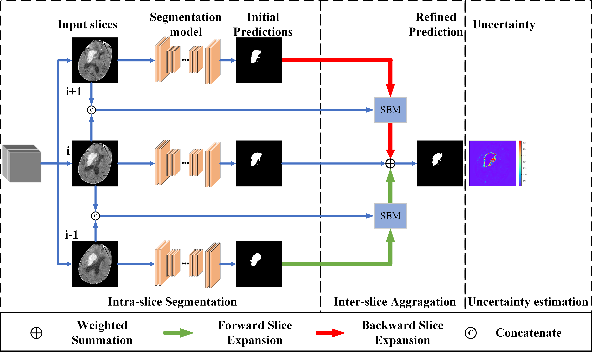
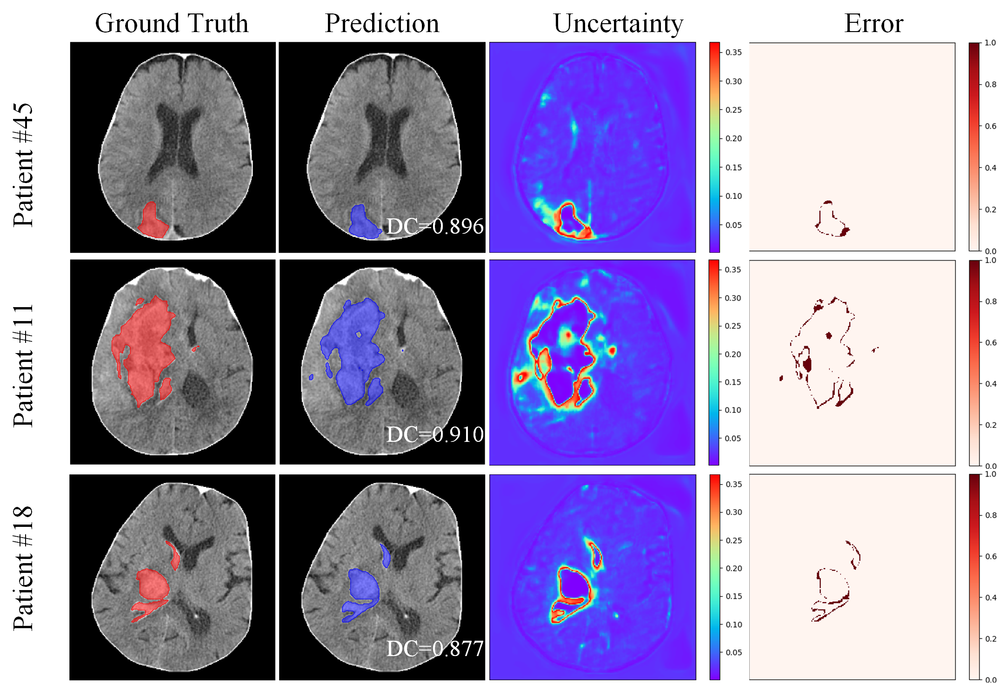

# SLEX-Net

[Hematoma Expansion Context Guided Intracranial Hemorrhage Segmentation and Uncertainty Estimation(Pytorch)](https://ieeexplore.ieee.org/abstract/document/9511297)

<p align="center">
       Input Volume...............................  GroundTruth ................Predictions
</p>

<p align="center">
    
</p>


## Abstract

Accurate segmentation of the Intracranial Hemorrhage (ICH) in non-contrast CT images is signicant for computer-aided diagnosis. Although existing methods have achieved remarkable results, none of them ever incorporated ICH's prior information in their methods. In this work, for the rst time, we proposed
a novel SLice EXpansion Network (SLEX-Net), which incorporated hematoma expansion in the segmentation architecture by directly modeling the spatial variation of hematoma expansion. Firstly, a new module named Slice Expansion Module (SEM) was built, which can effectively transfer contextual information
between two adjacent slices by mapping predictions from one slice to another. Secondly, to perceive label correlation information from both upper and lower slices, we designed two information transmission paths: forward and backward slice expansion. By further exploiting intra-slice and inter-slice context with the information paths, the network significantly improved the accuracy and continuity of segmentation results. Moreover, the proposed SLEX-Net enables us to conduct an uncertainty estimation with one-time inference, which is much more efficient than existing methods. We evaluated the proposed SLEX-Net and compared it with some state-of-the-art methods. Experimental results demonstrate that our method makes signicant improvements in all metrics on segmentation performance and outperforms other existing uncertainty estimation methods in terms of several metrics. 


## Overview of The Proposed Method


<p align="center">
    
</p>


## Requirements  

+ The code has been written in Python (3.6) and requires [PyTorch](https://pytorch.org) (version 1.1.0)
+ Install the related packages by  transferring our conda environment  `conda env create -f requirements.yaml` or by run ` bash run.sh`


## Data Preparation 

We  utilized a in-house intracranial hemorrhage segmentation dataset,  which will be released in the future, 

To match the input data of our proposed network,  you have to make some arrangement of the original data.

+ Image preprocessing,  mainly "Skull Stripping" operations :
+ Generate `h5` files for training, validation and testing.

```python
python src/DataTransfer.py
```

Besides, you have to split the data into training/ validation/ test set. In our case, we simply choose the first 180 subjects as the training set and the next 20 subjects as the validation set, the last 50 subjects as the test set. 

**notice** : folder structure of the training , validation or testing data should be like this:  

```bash
$SEG_ROOT
├── data
│   ├── data_train
│   │   ├── 1.h5
│   │   ├── ...
│   │   └── 100.h5
│   └── data_val
│   |   ├── 1.h5
│   |   ├── ...
│   |   └── 100.h5
|   |── data_test
│       ├── 1.h5
│       ├── ...
│       └── 100.h5

```


## Train and Test

### For training phase, 

(1)  Edit [`config.py`](src/config.py) so as to be consistent with your local environment, especially `pre_trained_model`,

`pre_trained_SEM_model` and `data_path`.  Once you download the dataset and the pre-trained model,  you specify the corresponding paths to those items.

(2) Run `src/train_hybrid_single_out_consistency.py `  in the command line or in the python IDE directly.

```python
python src/train_hybrid_single_out_consistency.py
```


### For testing phase, 

(1)  Edit [`config.py`](src/config.py) so as to be consistent with your local environment, especially `ckp_test`

and `data_path`.   The data_path is the same as training phase , the  `ckp_test` is the path of the saved model of our network.

(2) Run `src/test_single_consistency.py `  in the command line or in the python IDE directly.

```python
python src/test_single_consistency.py
```


## Results

To illustrate the results of the proposed method, we made a qualitative analysis of the segmentation results, which can be seen as follows:

<p align="center">
    
</p>


The uncertainty estimation results are as follows:

<p align="center">
    
</p>


## Troubleshooting 

If you meet any questions when you run this code ,   please don't hesitate  to raise a new issue in the repository or directly contact us at lxycust@gmail.com.


## Citations

Please consider citing this project in your publications if it helps your research. The following is a BibTeX reference. The BibTeX entry  requires the `url` LaTeX package.

```latex
@ARTICLE{9511297,  
    author={Li, Xiangyu and Luo, Gongning and Wang, Wei and Wang, Kuanquan and Gao, Yue 	and Li, Shuo},  
    journal={IEEE Journal of Biomedical and Health Informatics},   
    title={Hematoma Expansion Context Guided Intracranial Hemorrhage Segmentation and 		Uncertainty Estimation},   
    year={2021},  
    volume={},  
    number={},  
    pages={1-1},  
    doi={10.1109/JBHI.2021.3103850}
}
```